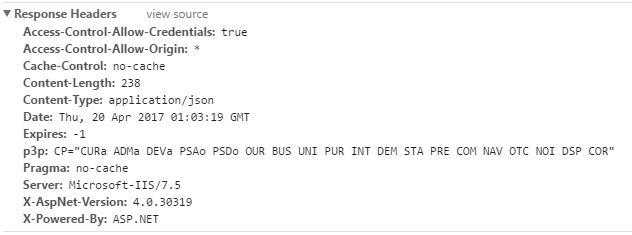

<link href="assets/css/page.css" rel="stylesheet" />
# 移除 Response Header中标识ASP.NET的信息
> 正常情况下，请求服务端api时，服务端会在Response Header中返回服务器的一些信息，比如服务器版本，所用的技术信息等等。  有时候我们并不想让请求端看到这些信息。

  
使用.NET框架时，我们关注的Response Header主要是四个：X-AspNet-Version,Server,X-Powered-By,X-AspNetMvc-Version。
  
## 1. X-AspNet-Version

> X-AspNet-Version标识的是IIS中运行的.Net Framework CRL的版本信息。

移除方式：在web.config中添加如下节点。

	<system.web>
		<httpRuntime enableVersionHeader="false"></httpRuntime>  
	</system.web>
	
## 2. X-Powered-By
> 其他服务端语言都会返回X-Powered-By这个信息。

移除方式：在web.config中添加如下节点。

	  <system.webServer>
		<httpProtocol>
	        <customHeaders>
	          <remove name="X-Powered-By"></remove>
	        </customHeaders>
	      </httpProtocol>
	  </system.webServer>
	  
## 3. Server
> Server标识的是web服务器处理程序信息和程序的版本信息，比如 "Microsoft-IIS/7.5", "nginx/1.0.11", "Apache"等等。

移除方式：在Global文件中，重写HttpApplication Init方法。

	public override void Init()
    {
        base.Init();
        base.PreSendRequestContent += (s, e) =>
        {
            HttpContext.Current.Response.Headers.Remove("Server");
 			HttpContext.Current.Response.Headers.Set("Server","MyServer");//可以自定义Server信息
            HttpContext.Current.Response.Headers.Remove("X-AspNet-Version"); //X-AspNet-Version 这样可以移除
            HttpContext.Current.Response.Headers.Remove("X-AspNetMvc-Version"); //X-ApsNetMvc-Version 这样移除
        };
    }
